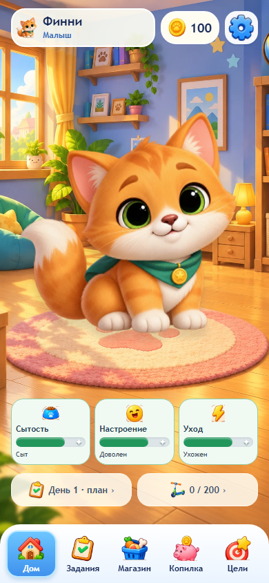

# Финни

[](https://github.com/Vorkhat/finni-game/actions/workflows/ci.yml)


> «Финни» — офлайн-игра по финансовой грамотности для детей 7–11 лет: ребёнок распоряжается
> ограниченным доходом, отделяет нужное от желаемого, копит на цель и видит последствия решений.

Игра полностью локальная: без регистрации, backend и сети. Профиль хранится в `localStorage`
браузера (или WebView на Android). Текущая программа: 10 игровых дней, 20 заданий (T01–T20),
60 ситуаций (S01–S60), три цели и три стадии развития питомца.



## Содержание

- [Quickstart — Windows](#quickstart--windows)
- [Разработчику: веб](#разработчику-веб)
- [Разработчику: Android](#разработчику-android)
- [Структура репозитория](#структура-репозитория)
- [Что входит](#что-входит)
- [Тестирование и CI](#тестирование-и-ci)
- [Документация](#документация)
- [Вклад](#вклад)
- [Лицензия](#лицензия)

## Quickstart — Windows

1. Полностью распакуйте ZIP в обычную папку. Не запускайте игру внутри архива.
2. Дважды нажмите START_GAME_WINDOWS.cmd.
3. Игра откроется в браузере по адресу http://127.0.0.1:18765.
4. Оставьте окно запуска открытым, пока играете. Чтобы остановить игру, закройте его.

Node.js, pnpm, сервер API и интернет для такого запуска не нужны. Используются встроенный Windows PowerShell и браузер. Если браузер не открылся автоматически, введите адрес выше вручную. Если порт занят, закройте прежнее окно запуска Финни. В системе с корпоративным запретом сценариев запуск может потребовать помощи администратора.

Не открывайте index.html двойным щелчком: игра использует маршруты и должна открываться через локальный сервер. На macOS/Linux разработчик может использовать сборку apps/web/dist с любым HTTP-сервером, поддерживающим возврат index.html для маршрутов приложения.

Подробнее — [docs/getting-started.md](docs/getting-started.md).

## Разработчику: веб

Проверено с Node.js 24 и pnpm 11.19.0. После установки Node.js установите pnpm 11.19.0 и выполните из корня репозитория:

```sh
npm install -g pnpm@11.19.0
pnpm install --frozen-lockfile
pnpm lint
pnpm test
pnpm build
pnpm dev
```

Установка зависимостей требует интернета. Для публикации скопируйте содержимое apps/web/dist в корень сайта. Настройте SPA fallback: /home, /tasks и другие маршруты должны возвращать index.html; существующие /assets/ должны отдаваться как файлы. Развёртывание в подпапке требует отдельной настройки базового пути. Backend и база данных текущей игре не нужны.

## Разработчику: Android

Нужны JDK 21, Android SDK (Platform 36), доступ к сети для загрузки зависимостей Gradle. После установки зависимостей проекта:

```sh
pnpm android:build
```

Команда пересобирает веб-версию, выполняет cap sync android и собирает debug APK. Результат: artifacts/android/Finni-1.0.0-debug.apk. Для Android Studio: pnpm android:sync, затем pnpm android:open. APK устанавливается отдельно от этой папки. Перед публикацией требуется проверка на телефоне и собственный ключ подписи; см. docs/deployment.md. Последняя версия в этом комплекте проверена как веб-приложение; Android APK этой версии в комплект не входит и на физическом телефоне здесь не проверялся.

## Структура репозитория

```text
Finni/
├── apps/web/          # SolidJS-приложение: src, public, собранный dist
├── apps/api/          # заготовка NestJS API, в игровом runtime не используется
├── packages/shared/   # домен, Zod-схемы, экономика, развитие питомца
├── packages/content/  # JSON/TS-контент программы: задания, ситуации, цели, товары
├── android/           # Capacitor Android-проект
├── e2e/               # Playwright-сценарии
├── scripts/           # сборка, portable-сервер, assets, Android
├── docs/              # документация и шесть ключевых скриншотов
├── .github/           # CI workflow «Verify Finni»
├── START_GAME_WINDOWS.cmd
└── package.json
```

## Что входит

- apps/web/dist — готовая актуальная веб-версия со всеми изображениями, шрифтами и четырьмя MP3.
- apps/web/src и public — исходный код интерфейса и локальные игровые ресурсы.
- packages — правила игры и контент: 20 заданий, 60 ситуаций.
- android, capacitor.config.ts, resources — Android-проект, конфигурация, значки и заставки.
- scripts — инструменты сборки и локальный запуск.
- e2e и тесты в исходниках — автоматические проверки.
- package.json, pnpm-lock.yaml, pnpm-workspace.yaml — зависимости и зафиксированные версии.
- apps/api — заготовка API; текущая игра работает без неё.

Файлы node_modules и инструменты Android не переносим: разработчик устанавливает зависимости на своём компьютере. Готовая веб-версия уже собрана и от них не зависит. Ключей публикации Android и учётных данных в архиве нет. Прогресс хранится в localStorage конкретного браузера и адреса, а не в папке; подробнее — [docs/getting-started.md](docs/getting-started.md).

## Тестирование и CI

```sh
pnpm lint    # tsc --noEmit по всем пакетам
pnpm test    # Vitest + node --test
pnpm build   # lint + tsc API + vite build
pnpm e2e     # build + Playwright
```

CI-джоб «Verify Finni» (`.github/workflows/ci.yml`) выполняет install, тесты, coverage и Playwright E2E.

## Документация

- [DOCUMENTATION.md](DOCUMENTATION.md) — короткий индекс документации.
- [docs/README.md](docs/README.md) — тематические документы (архитектура, данные, экономика, контент, развёртывание, требования).
- [CHANGELOG.md](CHANGELOG.md) — история изменений.
- [CONTRIBUTING.md](CONTRIBUTING.md) — правила участия.

## Вклад

См. [CONTRIBUTING.md](CONTRIBUTING.md).

## Лицензия

Файл лицензии в репозитории отсутствует; права на игровую графику принадлежат владельцу проекта.
